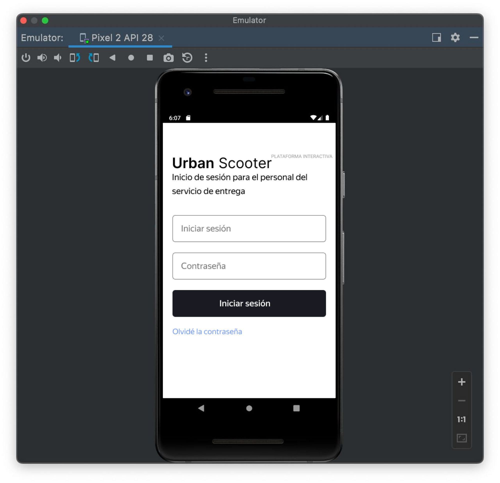
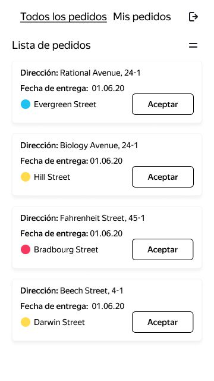
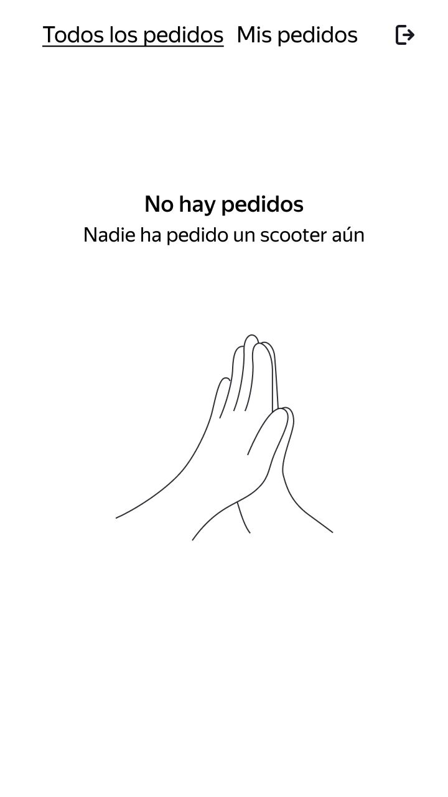
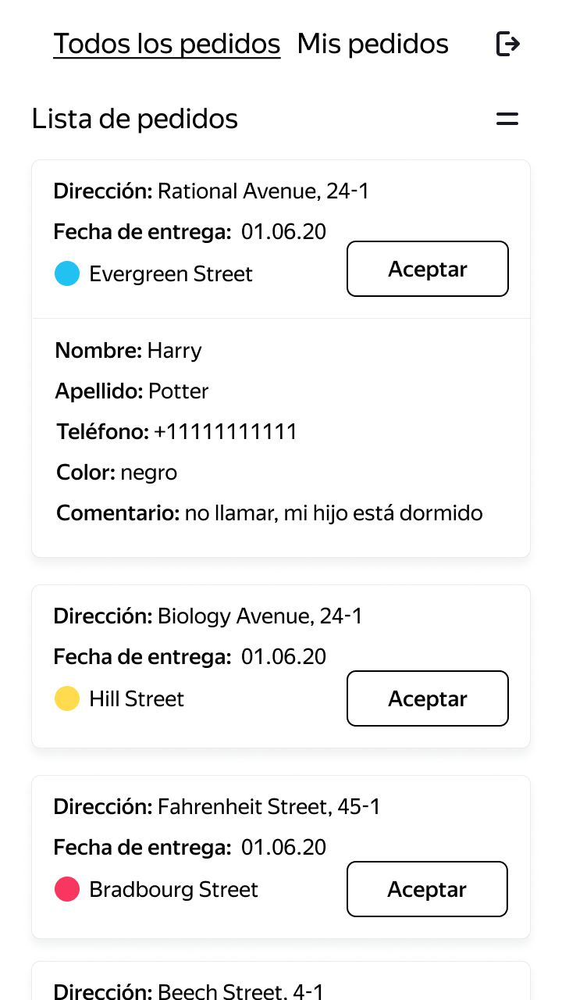
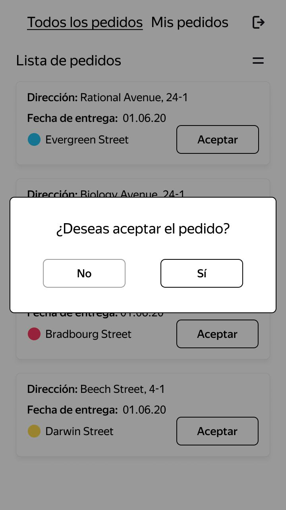
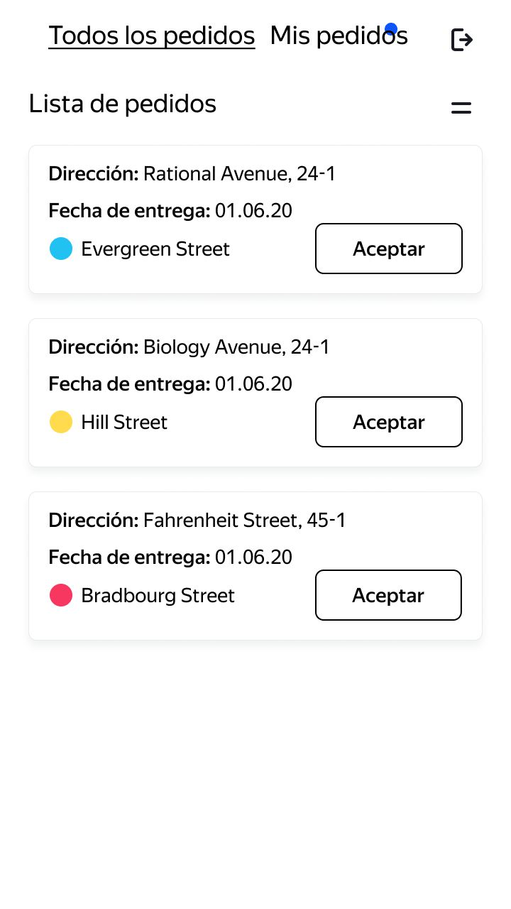
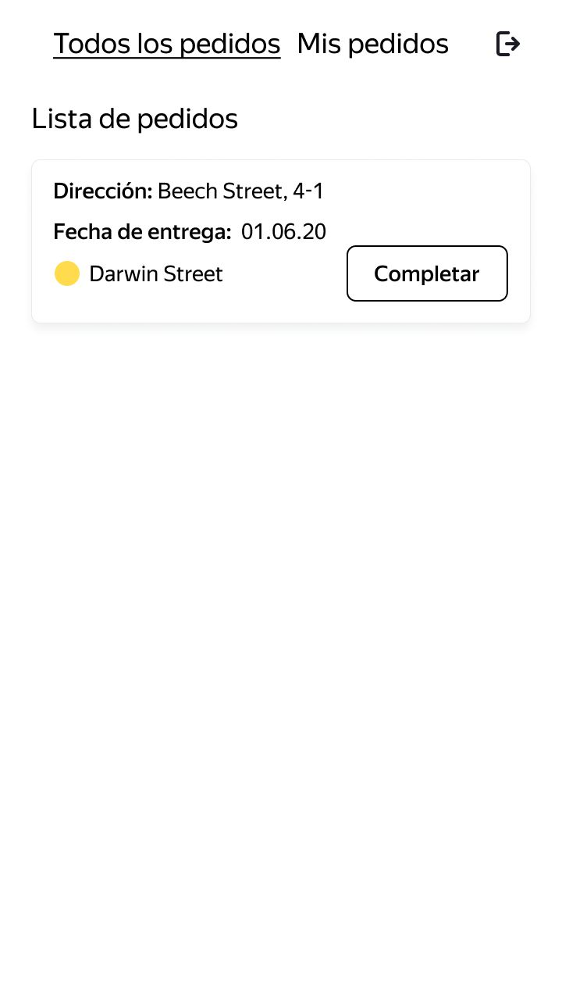
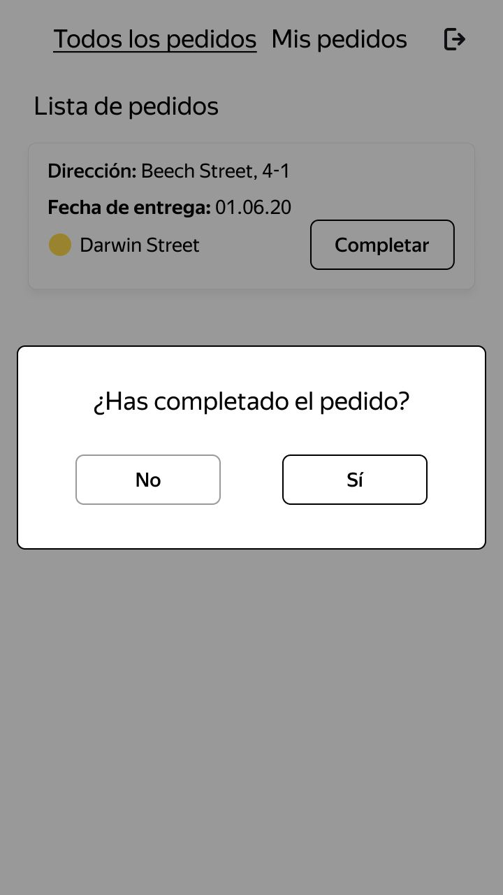
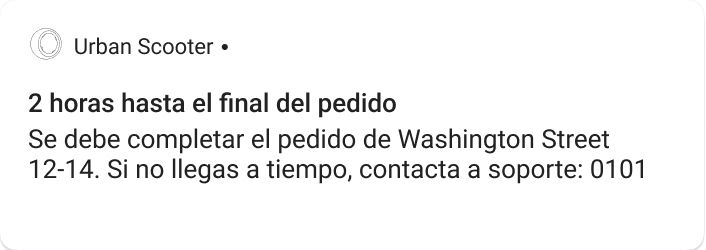
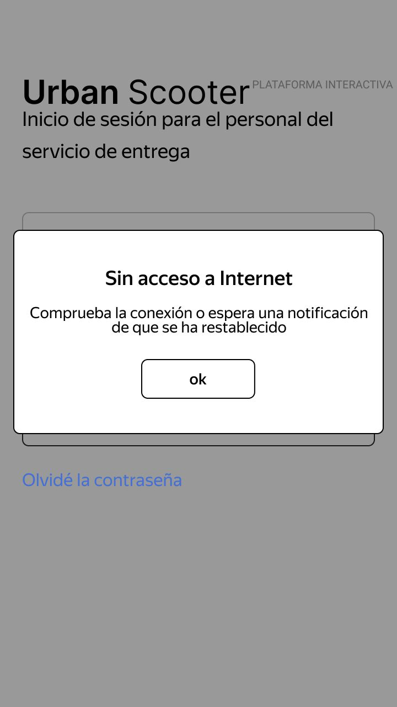

# Mobile Application Requirements - Urban Scooter

## "Login" Screen

1. The first time a user logs in to the application, a login screen appears.
2. If the courier has already logged in, they will see the default order list screen.
3. There are two input fields on the screen: Login and Password. There is a "Login" button.
4. If a user taps "Forgot password", a notification will appear with the text "Contact management: 0101" and an "Accept" button.
5. A user can exit the application from any screen. Then, upon logging in again, they will return to the login screen.

### Field Restrictions

| Element       | Requirements                                                                                                                                                                                               |
| :------------- | :------------------------------------------------------------------------------------------------------------------------------------------------------------------------------------------------------- |
| Login | Latin letters only. Text length is 2 to 10 characters. If the username or password are entered incorrectly, the notification "Invalid username or password" appears. |
| Password     | Integers only. Length is exactly 4 characters. If the username or password are entered incorrectly, the notification "Invalid username or password" appears.   |

## "Order List" Screen

There are two tabs on the screen: "Todos los pedidos" and "Mis pedidos".

In the "Todos los pedidos" tab, couriers see the same order list: these are unclaimed orders.

As soon as a courier accepts an order, it moves to the "Mis pedidos" tab and other couriers can no longer see it.

Within the "Mis pedidos" tab, the courier sees the orders they have accepted.

To refresh the list, a user must pull to refresh.

Pull to refresh:

1. In the "Todos los pedidos" tab: orders that were accepted by another courier disappear from the list.

2. In the "Todos los pedidos" tab: orders that have been canceled by the user are removed.

3. In both the "Todos los pedidos" and "Mis pedidos" tabs: cards are sorted by the delivery date specified by the user. Overdue orders are at the top.

Here is when the order list is updated:

1. When a user pulls to refresh.

2. If a user goes to the "Mis pedidos" tab on the home screen and then returns to the "Todos los pedidos" tab.

3. If a user applies a filter by metro station.

Here is when the order list is NOT updated:

1. If a user accepts an order, it moves to "Mis pedidos", but the rest of the list does not refresh.

Features of the "Order List" screen:

1. When there are no orders, the "Sin pedidos" screen is displayed. To refresh the screen, a user must pull to refresh.

2. When a user places an order, a short version of the order card appears.

3. The order list is sorted by delivery priority: overdue orders are at the top. An order is considered overdue if it was not delivered to the customer before 11:59 p.m. on the required day. The frame and date of the overdue card are highlighted in red and the text weight is Medium. This condition applies to both the "Todos los pedidos" and "Mis pedidos" lists.

4. Within the "Todos los pedidos" tab, there is a filter to select a metro station. With this, the courier can configure which stations they want to see orders for. Tapping the filter opens a list formed from the stations where orders exist. If there are two or more orders with the same metro station, the station name appears only once in the filter: duplicate stations do not appear.

5. The filter card increases in size as metro stations are added. The card has capacity for a maximum of 8 stations and, from the ninth onward, a scrollbar appears.

6. The order card has a short version and a full version.

- Fields for the short version: "Dirección", "Fecha de entrega" and selected metro station.

- Fields for the full version: "Dirección", "Fecha de entrega" and selected metro station. "Nombre", "Apellido", "Teléfono", "Color" and "Comentario" are added. If the user did not complete the "Color" field, it reads "cualquiera".

7. A user can change the card version by tapping the card. This works for both the "Todos los pedidos" and "Mis pedidos" tabs.

8. When a user switches to full card mode, the "Aceptar" button stays in place. The following cards in the list move down.

9. To accept the order, tap the "Aceptar" button; this works for both the short and full versions of a card.

10. Upon tapping the button, a notification appears with the text "¿Deseas aceptar el pedido?" and two buttons: "Sí" and "No". Tapping "No" will return the user to the order list and the "Aceptar" button will remain active. Tapping "Sí" confirms the order acceptance.

11. Users cannot accept someone else's order or a canceled order. The message "No puedes aceptar el pedido. Ya ha sido aceptado por otro repartidor o repartidora, o el usuario o usuaria lo ha cancelado." appears.

12. When the order is accepted, the card exits the "Todos los pedidos" list with an upward movement animation. When the order is accepted, the card exits the "Todos los pedidos" list with an upward movement animation.

13. Blue dot logic: it appears if there are cards that have not been viewed in the "Mis pedidos" tab. There is no automatic transition to the "Mis pedidos" tab.

14. The card accepted by the courier is placed in the "Mis pedidos" tab. The button changes to "Completar". A user can complete the order with a single tap on the "Completar" button, in both short and full card view.

15. If a user clicks "Completar", they will see the notification "¿Has completado el pedido?" and two buttons: "Sí" and "No". Tapping "Sí" confirms that the order is complete.

16. When the order is completed, the order card moves to the end of the list. If the order was overdue, but then completed, the card is not highlighted in red.

17. Completed orders are sorted by the time it took to complete them: the sooner an order is completed, the lower it will be in the list.

### Notification

1. **A notification arrives when 2 hours remain to complete an order. The order must be delivered on the day specified by the user before 11:59 p.m. For example, in the case of an order for May 8, if the courier has not delivered the scooter by 9:59 p.m. on May 8, they will receive a push notification.**

2. **The notification contains the following message: "2 horas hasta el final del pedido. Se debe completar el pedido "State St 1214". Si no llegas a tiempo, contacta a soporte: 0101".**

3. **Tapping the notification takes you to the "Mis pedidos" tab in the application.**

### No Internet Access

1. **If there is no Internet connection, a "Sin acceso a Internet" popup window is displayed. It appears when a user taps any active button on any screen and disappears only when tapping the "Aceptar" button.**

2. **When a user taps the "Aceptar" button, the popup notification closes. If there is still no Internet connection, the process repeats: tapping any active area leads to the "Sin acceso a Internet" popup notification.**

## Orientation

The application is in portrait orientation only.