# Requisitos aplicación web - Urban Scooter

## Versiones compatibles

La aplicación admite estos navegadores: Opera 71 o superior, Chrome 85 o superior. Se admitirán resoluciones de pantalla de 1280x720 y 1920x1080.

## Inicio

Hay un título y un plano de un scooter. Cuando el usuario o usuaria se desplaza, se muestra una animación: el plano se reemplaza por una foto y aparece una tabla con la descripción del producto.

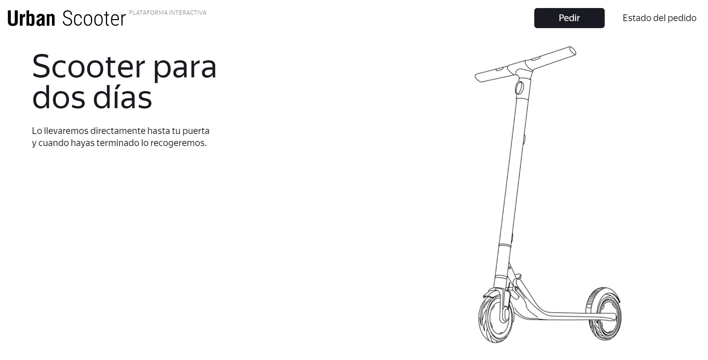

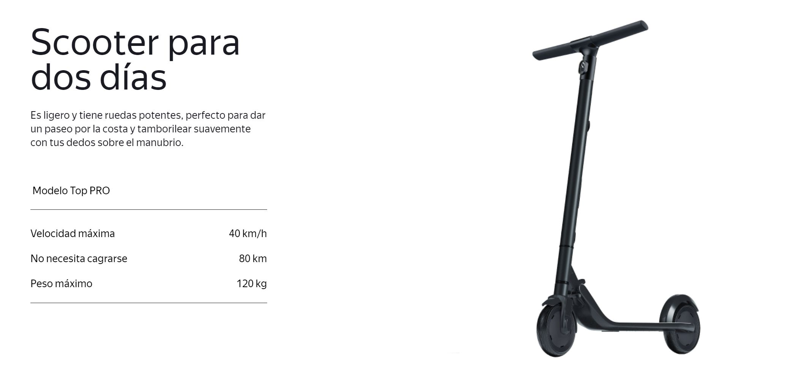

Hay dos botones en el encabezado del inicio: "Pedir" y "Estado del pedido".

Se le pide al usuario o usuaria que acepte el uso de cookies.

Si el usuario o usuaria se desplaza al tercer bloque, encuentra la siguiente información: "Cómo funciona", "Preguntas frecuentes".

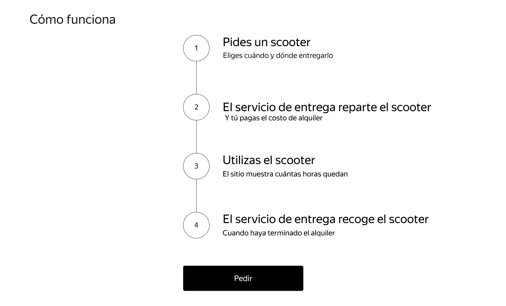

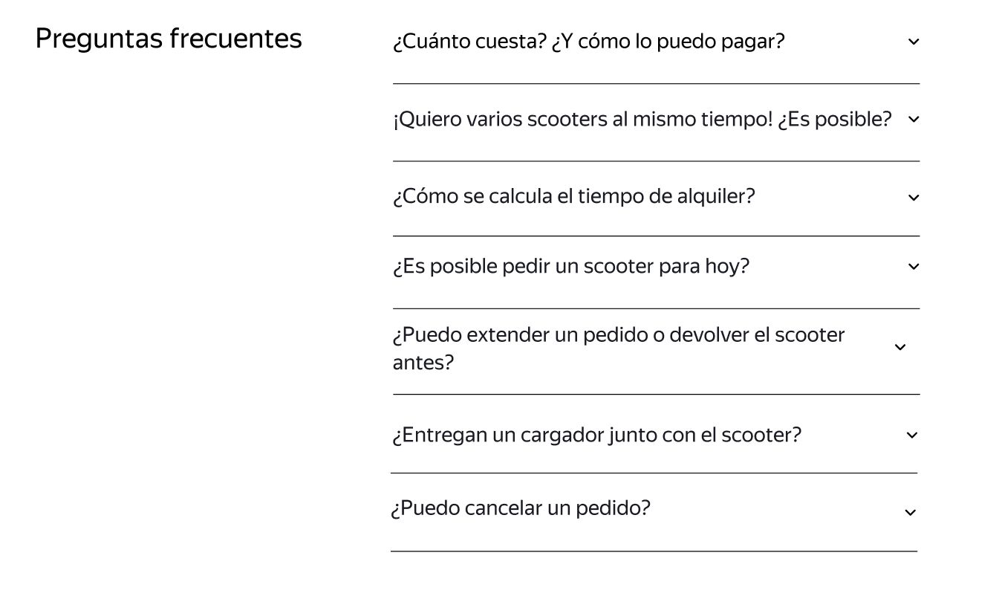

## Pantalla "Realizar pedido"

Para hacer un pedido, el usuario o usuaria necesita rellenar dos formularios: "Para quién es el scooter" y "Alquiler".

### Para quién es el scooter

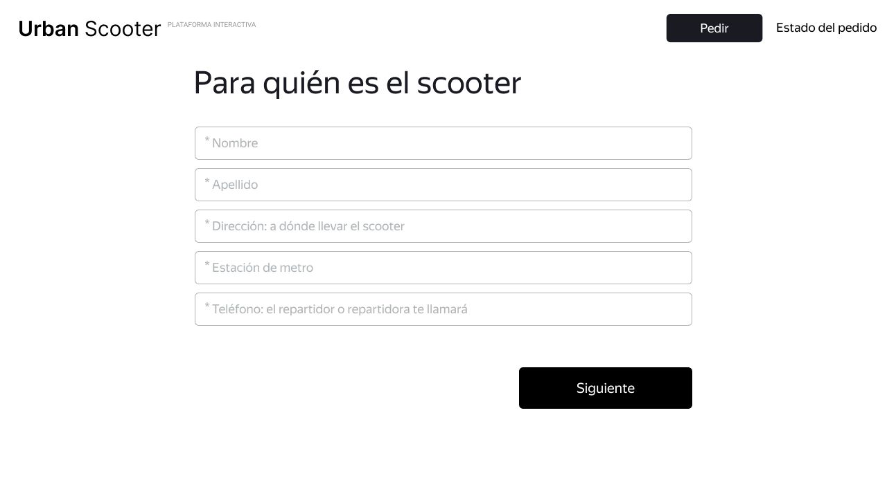

Los campos son: "Nombre", "Apellido", "Dirección: a dónde llevar el scooter", "Estación de metro" y "Teléfono: el repartidor o repartidora llamará".
Todos los campos son obligatorios. Si el usuario no los rellena correctamente, no puede avanzar a la siguiente página. En la parte inferior se encuentra el botón "Siguiente" que conduce al usuario o usuaria al formulario "Alquiler".

### Alquiler

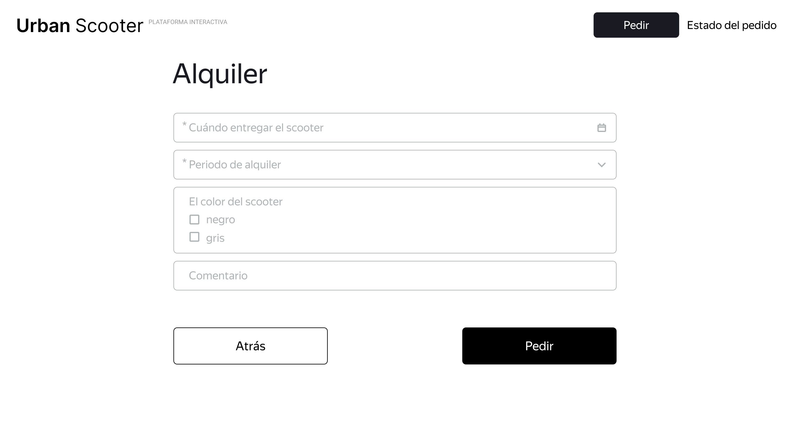

Los campos son "Fecha de entrega", "Periodo de alquiler", "Color del scooter" y "Comentario".

Los campos "Fecha de entrega" y "Periodo de alquiler" son obligatorios. "Color" y "Comentario" son opcionales.

**El botón "Atrás"**. Hacer clic en este conduce al usuario o usuaria a la página "Para quién es el scooter". Cuando el usuario se mueve entre páginas, se guarda la información que introdujo.

**El botón "Pedir"**. Si todos los campos se rellenaron correctamente, el pedido se hará cuando el usuario o usuaria haga clic en el botón "Pedir". Aparecerá una ventana emergente con el mensaje "Número de pedido NNNNN. Escríbelo: será útil para darle
seguimiento al estado" mediante el botón "Comprueba el estado". El botón "Comprueba el estado" conduce al usuario o usuaria a la pantalla "Estado del pedido": el campo "Número de pedido" ya está completado.

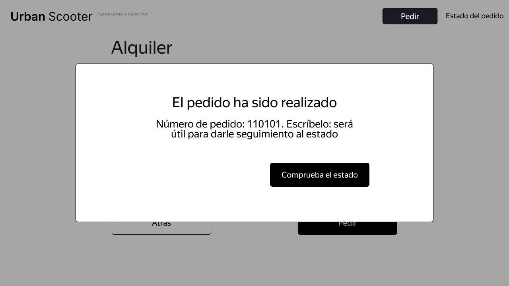

Si no se rellenaron correctamente todos los campos obligatorios, cuando el usuario o
usuaria haga clic en el botón "Pedir", aparecerá un error "Introduce un <nombre de campo> correcto".

El usuario o usuaria puede hacer varios pedidos, uno tras otro.

## Pantalla "estado del pedido"

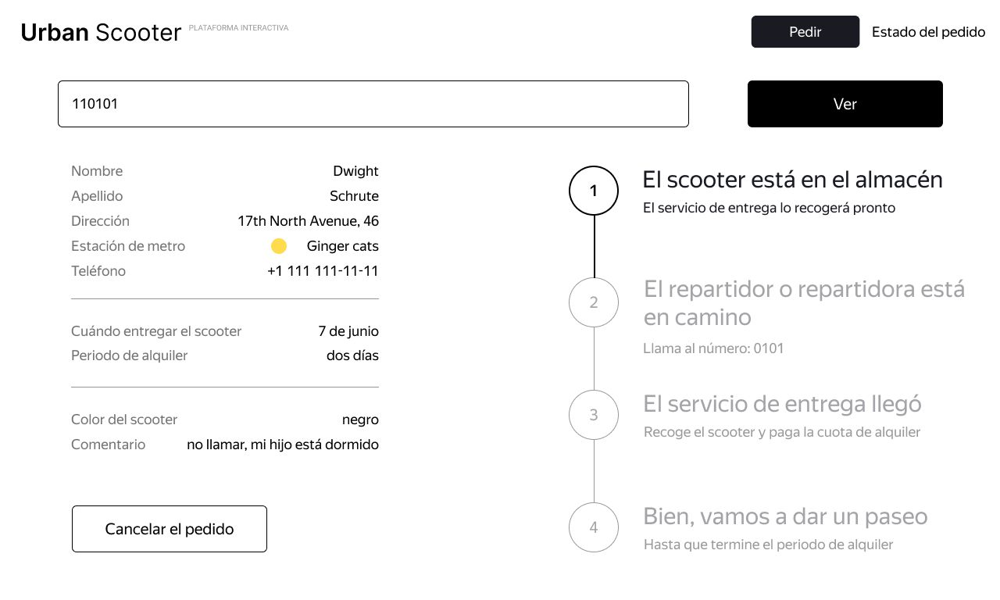

Si el usuario o usuaria hace clic en "Estado del pedido" en el encabezado del inicio, aparece el campo "Número de pedido" El usuario o usuaria debe introducir un valor y presionar Enter. Si el número de pedido se introduce correctamente, aparece la información:

- Datos del pedido del usuario o usuaria: nombre, apellido, dirección, entre otros. Hay una regla para todos los campos: si el texto no cabe en una línea, se pasa a la segunda.
- Cadena de estado del pedido. El estado actual está resaltado en negro, los demás son grises. Si se pasa el estado, el número delante de él cambia a una marca.

Si el número de pedido se introduce de forma incorrecta, aparece un mensaje de error: "No existe tal pedido. ¿Seguro que ese es el número correcto?".

Hay cuatro estados en la pantalla de estado del pedido. Solo uno de ellos puede estar activo en un momento dado: muestra en qué etapa se encuentra el pedido:

- **"El scooter está en el almacén"**. Se activa cuando el usuario o usuaria ha hecho un pedido.
- **"El repartidor o repartidora está en camino"**. Se activa cuando el repartidor o repartidora confirma en su aplicación que ha aceptado el pedido. Cuando el estado está activo, el nombre del repartidor o repartidora aparece en el aviso: "El repartidor Frodo está en camino". Si el nombre del repartidor o repartidora es demasiado largo y el aviso no cabe en una línea, el texto se mueve a la segunda línea.
- **"El servicio de entrega llegó"**. Se activa cuando el repartidor o repartidora presiona el botón "Completar" en su aplicación.
- **"Bien, vamos a dar un paseo"**. Se activa cuando el repartidor o repartidora ha confirmado la finalización del pedido. El texto "El alquiler finalizará el" aparece
  debajo del título de estado. El tiempo mostrado se calcula desde el momento en que se entrega el scooter al usuario o usuaria, considerando el número de días. Cuando finaliza el periodo de alquiler, el estado cambia a "Periodo de alquiler terminado" con la leyenda "El repartidor o repartidora recogerá el scooter pronto".

El usuario o usuaria puede introducir otro número de pedido y ver su estado.

### Cancelación de pedido

Si el usuario o usuaria hace clic en él, aparecerá una ventana emergente con el texto "¿Deseas cancelar el pedido?". Hay dos botones en la ventana emergente: "Cancelar" y "Atrás".

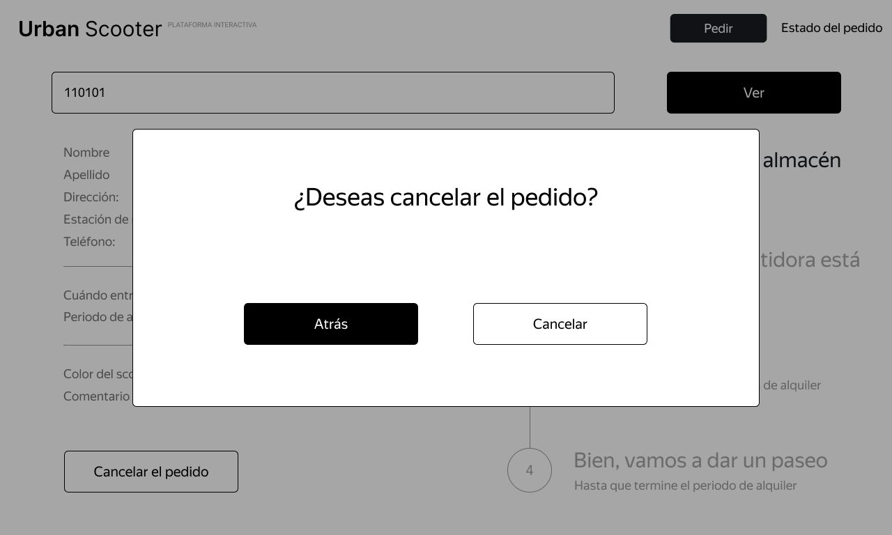

Si el usuario o usuaria hace clic en "Atrás", volverá a la página de estado del pedido.

Si el usuario o usuaria hace clic en "Cancelar", aparecerá una ventana emergente con el texto "El pedido ha sido cancelado. Siéntete libre de volver en cualquier momento :)", y hay un botón "Bien". El botón "Bien" llevará al usuario o usuaria a la página de inicio.

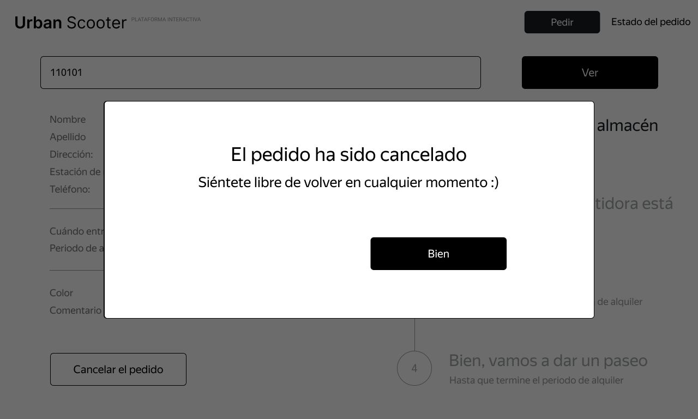

El usuario o usuaria puede cancelar el pedido antes de que el repartidor o repartidora lo recoja. Cuando el repartidor o repartidora ya tenga el pedido, no se podrá hacer clic en el botón "Cancelar el pedido".

El pedido cancelado se elimina del sistema, el usuario o usuaria no puede verlo

### Pedido atrasado

Un pedido se considera atrasado cuando el repartidor o repartidora no lo entregó a tiempo. Por ejemplo, un usuario o usuaria pidió un scooter para el 1 de enero. Si el scooter no se entrega a las 11:59 p.m. del 1 de enero o antes, el pedido está atrasado.

Si el pedido está atrasado, su estado cambia a "El repartidor o repartidora se demoró" y el mensaje cambia a "No podremos entregar el scooter a tiempo. Para aclarar el estado de tu pedido, llama a soporte: 0101." El estado y la leyenda están resaltados en rojo.

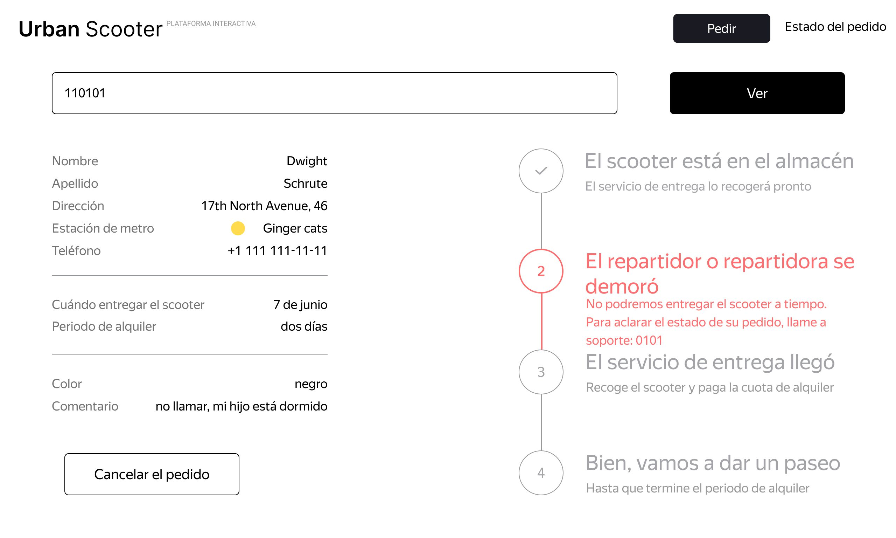

Si se ha entregado al usuario o usuaria un pedido atrasado, la cuenta regresiva para el final del periodo de alquiler comienza cuando se recibe el pedido.

## Perfeccionamiento del front-end

Se ha agregado un quinto estado a la cadena de estado: "El periodo de alquiler terminó". Esta es una función que sólo se implementó en el front-end, y el back-end aún no está listo. Este mensaje solía aparecer en lugar del cuarto estado, en el momento en que el periodo de alquiler estaba por terminar. Ahora el texto en el cuarto estado no cambia, simplemente se vuelve gris, como los otros estados.

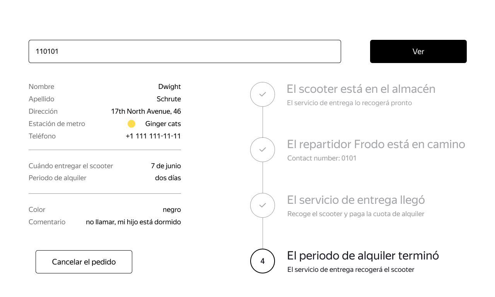

Un ejemplo de la respuesta se describe en la documentación de la API en el bloque _Pedidos:_ obtener pedido por su número.

Nuevo número de estado en la solicitud = 3.

## Restricciones de los campos

| Nombre              | Tipo de campo                                                                                | Valores posibles                                                                                                                                                                                                                                                                                                                                           | Obligatorio |
| :------------------ | :------------------------------------------------------------------------------------------- | :--------------------------------------------------------------------------------------------------------------------------------------------------------------------------------------------------------------------------------------------------------------------------------------------------------------------------------------------------------- | :---------- |
| Nombre              | Campo de texto                                                                               | Solo letras latinas, espacios y guiones. La longitud debe ser de 2 a 15 caracteres. Si se introduce de forma incorrecta, se resalta en rojo. El mensaje de error es "Introduce un nombre correcto".                                                                                                                                                        | ✔           |
| Apellido            | Campo de texto                                                                               | Solo letras latinas, espacios y guiones. La longitud debe ser de 2 a 15 caracteres. Si la entrada es no válida, se resalta en rojo y aparece el mensaje de error "Introduce un apellido válido".                                                                                                                                                           | ✔           |
| Dirección           | Campo de texto                                                                               | Solo letras del alfabeto latino, números, espacios, guiones, puntos, y comas. La longitud debe ser de 5 a 50 caracteres. Los espacios antes y después de una dirección se borran cuando se quita el enfoque (focus). Si la entrada es no válida, se resalta en rojo y aparece el mensaje de error "Introduce una dirección válida".                        | ✔           |
| Estación de metro   | Campo de texto con una sugerencia                                                            | Estaciones de metro de Los Ángeles. La lista de estaciones se almacena en el back-end (en la API).                                                                                                                                                                                                                                                         | ✔           |
| Teléfono            | Campo de texto                                                                               | Solo números y el símbolo "+". La longitud debe ser de 10 a 12 caracteres. Si se introduce de forma incorrecta, se resalta en rojo. El mensaje de error es "Introduce un número de teléfono válido".                                                                                                                                                       | ✔           |
| Fecha de entrega    | Calendario desplegable. Aparece cuando el usuario o usuaria hace clic en el campo de entrada | Solo se pueden elegir fechas a partir del día siguiente. El calendario se abre con el mes actual. Los valores no se pueden introducir manualmente en el campo. Cuando el usuario o usuaria selecciona una fecha, el valor aparece inmediatamente en el campo. El usuario o usuaria puede seleccionar una fecha diferente, el campo está resaltado en azul. | ✔           |
| Periodo de alquiler | Lista desplegable                                                                            | Se puede elegir de 1 a 7 días.                                                                                                                                                                                                                                                                                                                             | ✔           |
| Color               | Casilla de verificación                                                                      | Negro, gris. Se puede elegir una o ambas opciones.                                                                                                                                                                                                                                                                                                         | ⨉           |
| Comentario          | Campo de texto                                                                               | Solo letras del alfabeto latino, números, espacios, guiones, puntos y comas. La longitud maxima es de 24 caracteres.                                                                                                                                                                                                                                       | ⨉           |

## Preguntas frecuentes
- ¿Cuánto cuesta? ¿Y cómo lo puedo pagar?

Son $8 por día. El servicio de entrega recibe pagos en efectivo o con tarjeta.

- ¿Entregan un cargador junto con el scooter?

El scooter viene completamente cargado. Eso es suficiente para ocho días de paseo sin parar. No necesitarás un cargador.

- ¿Me pueden traer el scooter hoy?

Solo para el día siguiente después de realizar el pedido, pero próximamente podremos entregarlos antes.

- ¡Quiero varios scooters al mismo tiempo! ¿Es posible?

Por ahora, solo es un scooter por pedido. Si quieres dar un paseo con amigos, se pueden hacer varios pedidos.

- ¿Puedo extender un pedido o devolver el scooter antes?

¡Todavía no! Si es algo urgente, siempre puedes llamar a soporte al número 1010.

- ¿Puedo cancelar el pedido?

Sí, puedes cancelarlo antes de que el repartidor o repartidora te entregue el scooter. No habrá multa y no te pediremos una explicación.

- ¿Cómo se calcula el tiempo de alquiler?

Digamos que haces un pedido para el 8 de mayo. Te entregaremos el scooter en esa fecha antes del final del día. El tiempo de alquiler inicia cuando pagas tu pedido al servicio de entrega. Si te entregamos el scooter el 8 de mayo a las 8:30 p.m., el alquiler diario terminará el 9 de mayo a las 8:30 p.m.