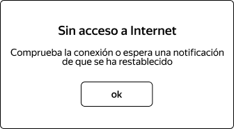

# Title

The popup window has black borders.

# Environment

- Android Emulator: Galaxy A3, Android 9
- Postman 12.17.3

# Component

No Internet Access - Popup Window

# Preconditions

- Internet access is available on the device/emulator.

1. Create a courier account with "login": "apm96", "password": "1234", "firstName": "Ariel" using POST /api/v1/courier.

2. Enter the backend URL in the login screen of the mobile application.

3. Log in with the credentials of the courier account that was created.

3. Log in with the credentials of the courier account that was created.

# Steps to Reproduce

1. Activate airplane mode.

2. Tap "Todos los pedidos".

3. Observe the popup window.

# Expected Result

- The popup window has black borders.

# Evidence

