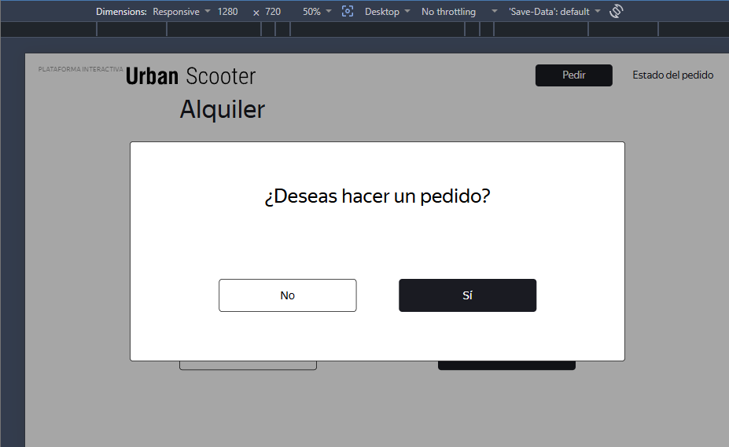
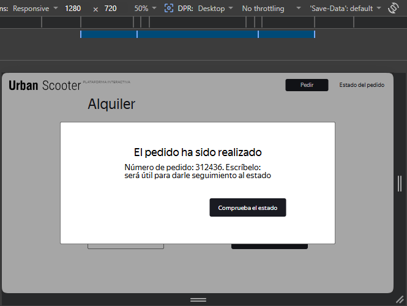

# US-1: Undocumented confirmation popup blocks order creation in Chrome (works in Opera)

# Key details

## Severity
🟠 Major

## Priority
🟧 High

## Environment
Chrome 149, 1280x720 (failed) / Opera 132, 1280x720 (works with deviation)

## Component
Place Order - "Alquiler" form

## Description

### Deviation from requirements and design
When clicking “Pedir” with valid data, an undocumented confirmation popup appears: “¿Deseas hacer un pedido?” with buttons “No” and “Sí”. This popup:

- Is not described in the business requirements.
- Does not appear in the Figma designs.

According to the BRD, the expected behavior is:

> 'If all fields were filled in correctly, the order is placed when the user clicks the "Pedir" button. A popup appears with the message "Número de pedido NNNNN. Escríbelo: será útil para darle seguimiento al estado" via the "Comprueba el estado" button.'

No intermediate confirmation step is mentioned.

### Browser behavior
- Chrome 149: The popup appears. Clicking “Sí” does nothing. The order is not created.
- Opera 132: The popup appears. Clicking “Sí” works: the order is created and the number is displayed.

### Impact
- In Chrome, the happy path is completely blocked.
- In Opera, the flow proceeds but introduces an undocumented step that contradicts requirements and design.

### Steps to reproduce
1. Open the application in Chrome 149 (1280x720).
2. Click “Pedir”.
3. Enter “Ariel” in the “Nombre” field.
4. Enter “Pino” in the “Apellido” field.
5. Enter “1st Street” in the “Dirección” field.
6. Select “5th Street” in the “Estación de metro” field.
7. Enter “+19999999999” in the “Teléfono” field.
8. Click “Siguiente”.
9. Select tomorrow’s date in the “Fecha de entrega” field.
10. Select “un día” in the “Periodo de alquiler” field.
11. Click “Pedir”.
12. In the popup, click “Sí”.

### Expected result
After clicking “Pedir”, the “El pedido ha sido realizado” popup appears directly with the order number.

### Actual result
An undocumented confirmation popup “¿Deseas hacer un pedido?” appears.
- In Chrome, clicking “Sí” does nothing.
- In Opera, the flow continues and the order is created.

### Evidence

#### Chrome popup screenshot

#### Opera popup after successful click screenshot
