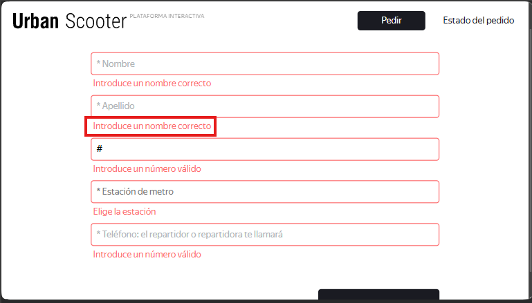

# US-12: If "Apellido" is empty or invalid, advancing shows error "Introduce un apellido correcto".

# Key details

## Severity
🔵 Minor

## Priority
🟩 Low

## Environment
- Opera 132, 1920x1080

## Component
Home Page - Header

## Description

### Preconditions
1. Open the web application in Opera.
2. Click "Pedir".

### Steps to reproduce
1. Click "Siguiente".
2. Observe the error message in the "Apellido" field.

### Expected result
It shows the error message "Introduce un apellido válido".

### Actual result
It shows the error message "Introduce un nombre correcto".

### Evidence
#### Screenshot of the current error message
