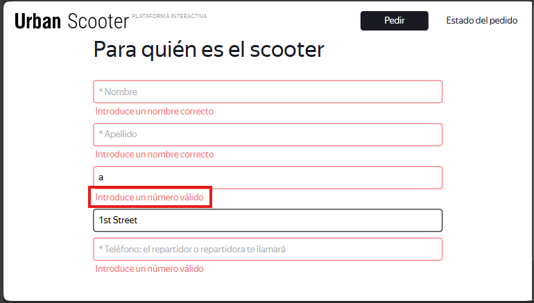

# US-13: If "Dirección" is empty or invalid, trying to advance shows error "Introduce un dirección correcto".

# Key details

## Severity
🔵 Minor

## Priority
🟩 Low

## Environment
- Opera 132, 1920x1080

## Component
Home Page - Header

## Description

### Preconditions
1. Start the web application in Opera.
2. Click "Pedir".

### Steps to reproduce
1. Click "Siguiente".
2. Observe the error message in the "Dirección" field.

### Expected result
It shows the error message "Introduce una dirección válida".

### Actual result
It shows the error message "Introduce un número válido".

### Evidence
#### Screenshot of the current error message
