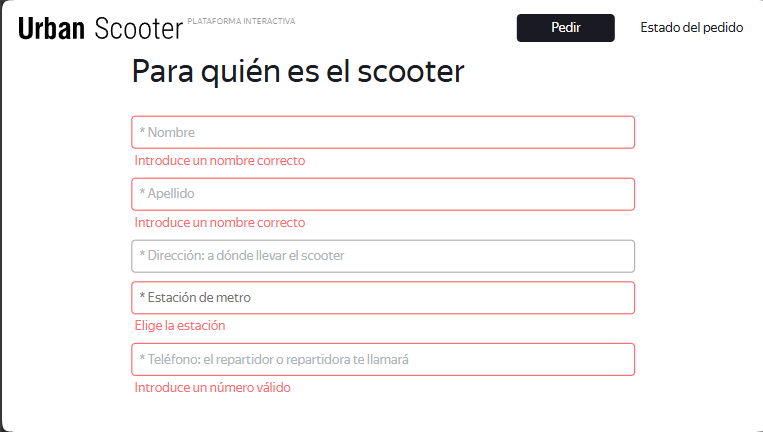

# US-15: Si "Teléfono" está vacío o es inválido, al intentar avanzar se muestra error "Introduce un número de teléfono válido".

# Detalles clave

## Severidad
🔵 Minor

## Prioridad
🟩 Low

## Entorno
- Opera 132, 1920x1080

## Componente
Página de Inicio - Header

## Descripción

### Precondiciones
1. Iniciar la aplicación web en Opera.
2. Hacer clic en “Pedir“.

### Pasos para reproducir
1. Hacer clic en “Siguiente“.
2. Observar mensaje de error en el campo "Teléfono".

### Resultado esperado
Muestra mensaje de error “Introduce un número de teléfono válido”.

### Resultado actual
Muestra mensaje de error “Introduce un número válido".

### Evidencia
#### Captura de pantalla del mensajero de error actual
