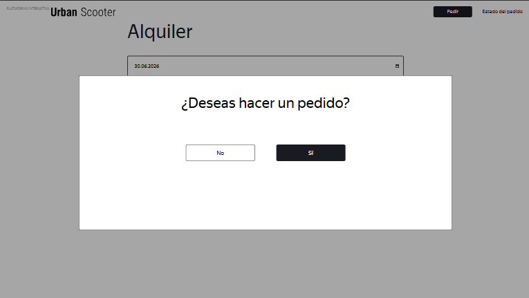

# US-16: Validación de fecha de entrega ausente: se permite realizar pedidos con fechas inválidas

# Detalles clave

## Severidad
🟠 Major

## Prioridad
🟧 High

## Entorno
- Opera 132, 1920x1080

## Componente
Realizar Pedido - Formulario "Alquiler"

## Descripción

### Precondiciones
1. Ingresar a la página de inicio con Opera.
2. Hacer clic en “Pedir”.
3. Rellenar el formulario “Para quién es el scooter” con datos válidos y hacer clic en “Siguiente“.

### Pasos para reproducir
1. Seleccionar la fecha de hoy en el campo “Fecha de entrega“.
2. Seleccionar “un día“ en el campo “Periodo del alquiler“.
3. Hacer clic en “Pedir“.

### Resultado esperado
Debe mostrarse un mensaje de error: “Introduce una fecha de entrega correcta“. La ventana emergente de confirmación no debe de aparecer.

### Resultado actual
No se muestra mensaje de error. Aparece la ventana emergente “¿Desea hacer un pedido?“.

### Evidencia
#### Captura de pantalla del formulario con la fecha inválida y la ventana emergente abierta
