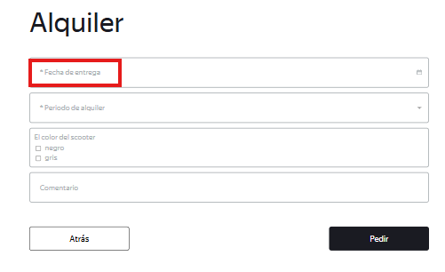
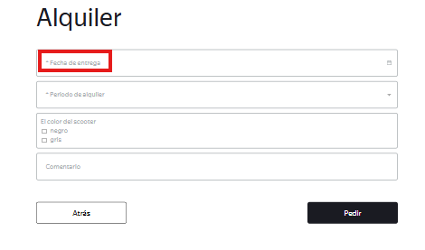

# US-19: Placeholder de "Fecha de entrega" no coincide con el diseño.

# Detalles clave

## Severidad
🔵 Minor

## Prioridad
🟩 Low

## Entorno
- Chrome 149, 1920x1080
- Opera 132, 1920x1080

## Componente
Realizar Pedido - Formulario "Alquiler"

## Descripción

### Precondiciones
Ingresar a la página de inicio en ambos entornos.

### Pasos para reproducir
1. Hacer clic en “Pedir”.
2. Llenar los campos del formulario con datos válidos y hacer clic en “Siguiente”.
3. Observar el texto del placeholder del campo “Fecha de entrega”.

### Resultado esperado
El texto del placeholder coincide con “* Cuándo entregar el scooter“.

### Resultado actual
El texto del placeholder dice “* Fecha de entrega“.

### Evidencia
#### Captura de pantalla del campo actual
##### Chrome

##### Opera

