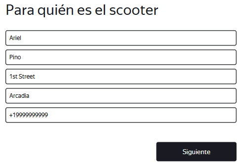
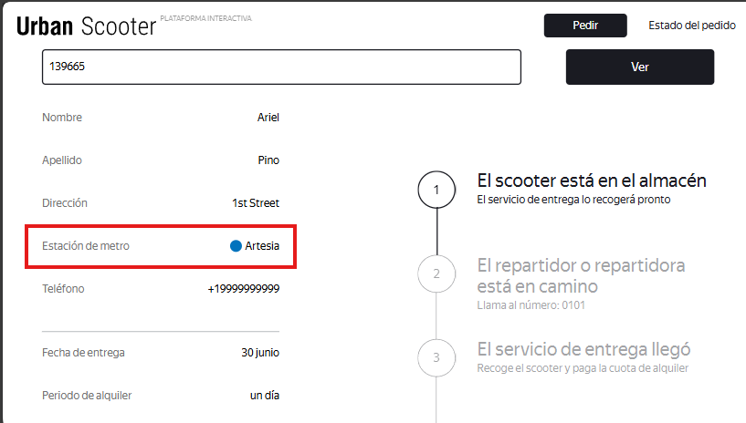

# US-2: La estación de metro en "Estado del pedido" no coincide con la ingresada en el formulario

# Detalles clave

## Severidad
🟠 Major

## Prioridad
🟧 High

## Entorno
Opera 132, 1280x720 (Chrome bloqueado por [US-1](./US-1.md))

## Componente
Estado del Pedido - Información del Pedido

## Descripción
Al consultar un pedido en la pantalla “Estado del pedido“, el valor mostrado en el campo “Estación de metro“ es diferente al que se ingresó en el formulario “Para quién es el scooter“.

### Pasos para reproducir
1. Abrir la aplicación en Opera (1280x720).
2. Hacer clic en “Pedir“.
3. Ingresar “Ariel“ en el campo “Nombre“.
4. Ingresar “Pino“ en el campo “Apellido“.
5. Ingresar “1st Street“ en el campo “Dirección“.
6. Seleccionar “Arcadia“ en el campo “Estación de metro“.
7. Ingresar “+19999999999“ en el campo “Teléfono“.
8. Hacer clic en “Siguiente“.
9. Seleccionar la fecha de mañana en el campo “Fecha de entrega“.
10. Seleccionar “un día“ en el campo “Periodo de alquiler“.
11. Hacer clic en “Pedir“.
12. En la ventana emergente “¿Deseas hacer un pedido?“, hacer clic en “Sí“.
13. En la ventana emergente “El pedido ha sido realizado“, hacer clic en “Comprueba el estado“.

### Resultado esperado
Se muestra “Arcadia“ en “Estación de metro“.

### Resultado actual
Se muestra “Artesia“ en “Estación de metro“.

### Evidencia

#### Captura de pantalla del formulario con el dato ingresado

#### Captura de pantalla de “Estado del pedido“ mostrando el dato incorrecto
