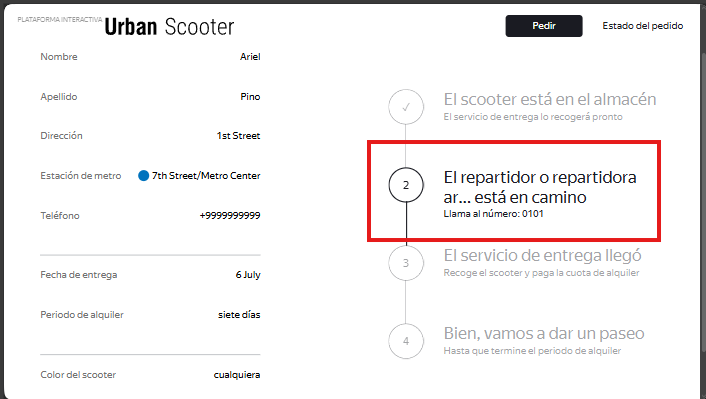

# US-3: El nombre largo del repartidor se trunca en lugar de pasar a una segunda línea

# Detalles clave

## Severidad
🔵 Minor

## Prioridad
🟩 Low

## Entorno
- Opera 132, 1280x720 (Chrome bloqueado por [US-1](./US-1.md))
- Postman 12.16.4

## Componente
Estado del Pedido - Cadena de Estados

## Descripción
Cuando el estado “El repartidor o repartidora está en camino“ está activo y el nombre del repartidor es demasiado largo para una línea, el aviso no se ajusta a una segunda línea como indican los requisitos, sino que se trunca con puntos suspensivos (…).

Según el documento de requisitos:

> “Si el nombre del repartidor o repartidora es
demasiado largo y el aviso no cabe en una línea, el texto se mueve a la segunda
línea.“

Esto no se cumple; el texto se corta.

### Pasos para reproducir
1. Crear un pedido válido (usar Opera 1280x720) y guardar el número de pedido.
2. Mediante Postman, crear una cuenta de mensajero con `POST` `/api/v1/courier` con el body:
    ```json
    {
        "login": "arielpinomeza96arielpinomeza96",
        "password": "ariel",
        "firstName": "Ariel"
    }
    ```
3. Mediante Postman, iniciar sesión con `POST` `/api/v1/courier/login` con el body: 
    ```json
    {
        "login": "arielpinomeza96arielpinomeza96",
        "password": "ariel"
    }
    ```
    Guardar el ID de mensajero que devuelve la respuesta.
4. Mediante Postman, consultar los datos del pedido hecho usando el número de pedido para obtener su ID con `GET` `/api/v1/orders/track?t=<numero_de_orden>`.
5. Mediante Postman, aceptar la orden con `PUT` `/api/v1/orders/accept/:<id_orden>?courierId=<id_mensajero>`.
6. Ingresar a la página de inicio de Urban Scooter.
7. Hacer clic en “Estado del pedido“.
8. Ingresar el número de pedido en el campo “Número de pedido“.
9. Hacer clic en “¡Vamos!“.
10. Observar el texto del segundo estado.

### Resultado esperado
El aviso muestra el nombre completo del repartidor, y si no cabe en una línea, el texto continúa en una segunda línea.

### Resultado actual
El texto aparece truncado: “El repartidor o repartidora ar ... está en camino“.

### Evidencia

#### Captura de pantalla del estado con el texto truncado
