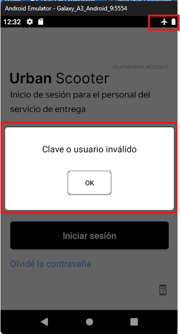

# US-32: Se muestra ventana emergente "Clave o usuario inválido" al tocar "Iniciar sesión" sin conexión a internet

# Detalles clave

## Severidad
🔵 Minor

## Prioridad
🟩 Low

## Entorno
- Emulador Android: Galaxy A3, Android 9

## Componente
Móvil - Falta de Acceso a Internet - Ventana Emergente

## Descripción

### Precondiciones

Modo avión activo en el dispositivo/emulador.

### Pasos para reproducir
1. Abrir la aplicación.

2. Tocar "Iniciar sesión".

### Resultado esperado
Aparece ventana emergente "Sin acceso a Internet".

### Resultado actual
Captura de pantalla de con la ventana emergente “Clave o usuario inválido” visible y mostrando el modo avión activado.

### Evidencia 

