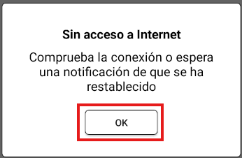

# US-33: "OK" confirmation button of "Sin acceso a Internet" popup is displayed in uppercase

# Key details

## Severity
⚪ Trivial

## Priority
🟩 Low

## Environment
- Android Emulator: Galaxy A3, Android 9
- Postman 12.17.3

## Component
Mobile - No Internet Access - Popup

## Description

### Preconditions

- Internet access is available on the device/emulator.
1. Create a courier account with "login": "apm96", "password": "1234", "firstName": "Ariel" using POST /api/v1/courier.
2. Enter the backend URL in the login screen of the mobile application.
3. Sign in with the credentials of the courier account that was created.

### Steps to reproduce
1. Enable airplane mode.
2. Tap "Todos los pedidos".
3. Observe the confirmation button.

### Expected result
"OK" button displayed in standard case at the bottom.

### Actual result
"OK" button displayed in uppercase at the bottom.

### Evidence

