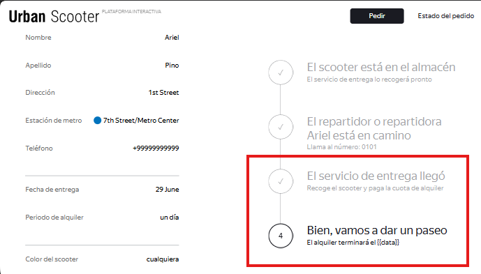

# US-4: The "El servicio de entrega llegó" status is gray and shows a checkmark when the order is completed - possible duplicate record consequence

# Key details

## Severity
🟠 Major

## Priority
🟧 High

## Environment
- Opera 132, 1280x720 (Chrome blocked by [US-1](./US-1.md))
- Postman 12.16.4
- Ez-scooter API version 1.0.0
- Mobile device
    - Samsung Galaxy S23+
    - Android version: 16
- Urban Scooter mobile app version 1.0

## Component
Order Status - Status Chain

## Description
When trying to verify that the third status “El servicio de entrega llegó” becomes active when the courier presses “Completar” in the mobile app, the order was found to be duplicated in the database ([US-5](./US-5.md)). To force the status chain to advance, both records had to be completed; when that happened, status 3 appeared inactive and status 4 appeared active.

This behavior appears to be a symptom of [US-5](./US-5.md), since the status logic may be operating on multiple records for the same order. US-5 needs to be resolved before this test can be rerun.

### Preconditions
- US-5 resolved.
- There is an order created with a known order number.
- A courier account has been created (via API).
- The Urban Scooter mobile app version 1.0 is installed on a physical device or emulator with Android 16.
- The courier has logged in successfully with the credentials used to register the courier.

### Steps to reproduce
1. Create a valid order in Opera 1280×720 and save the order number.
2. In the mobile app, on the “Todos los pedidos” screen, locate the newly created order and tap “Aceptar”.
3. Tap “Sí” in the “¿Deseas aceptar el pedido?” popup.
4. Tap “Mis pedidos”.
5. Tap “Completar” on the first of the two records shown (both records are for the same order).
6. Tap “Sí” in the “¿Has completado el pedido?” popup.
7. Repeat the same for the other order record.
8. Open the app home page in Opera.
9. Click “Estado del pedido”.
10. Enter the order number that meets the previous preconditions and click “¡Vamos!”.
11. Observe the status chain.

### Expected result
Status 3 ("El servicio de entrega llegó") is active (highlighted in black, with number 3 shown).

### Actual result (with [US-5](./US-5.md) present)
Status 3 appears gray with a completed checkmark.

### Evidence

#### Screenshot of the status chain showing status 3 inactive and status 4 active
