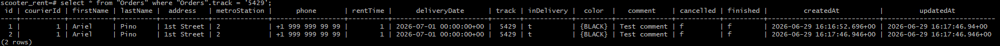
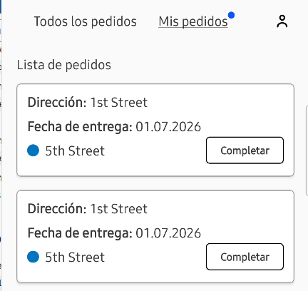

# US-5: Se duplica el pedido en la tabla "Orders" al aceptarlo

# Detalles clave

## Severidad
🟠 Major

## Prioridad
🟧 High

## Entorno
- Opera 132, 1280x720 (Chrome bloqueado por [US-1](./US-1.md))
- Postman 12.16.4
- Api Ez-scooter versión 1.0.0
- Dispositivo móvil
    - Samsung Galaxy S23+
    - Android version: 16
- Aplicación móvil “Urban Scooter“ versión 1.0

## Componente
API - Aceptación de Pedidos

## Descripción
Cuando el mensajero acepta una orden mediante la API, se inserta un registro adicional en la tabla `Orders` con el mismo `track` y datos del pedido original. Esto provoca que el mensajero vea **dos tarjeta de pedido idénticas** en la aplicación móvil.

Para que el usuario final vea reflejado el cambio de estado en el seguimiento, el mensajero debe completar ambos registros por separado.

### Precondiciones
- Existe un pedido con un `track` único.
- Existe un mensaje con credenciales válidas.
- El mensajero no tienen ningún pedido aceptado.
- Se ha obtenido el ID del mensajero y el ID del pedido mediante la API.

### Pasos para reproducir
1. Crear un pedido válido y obtener su número (`track`).
2. Mediante Postman, iniciar sesión como mensajero y obtener su `courierId`.
3. Obtener el `id` de la orden con `GET /api/v1/orders/track?t=<track>`.
4. Verificar que devuelve 1 registro al consultar la tabla `Orders` filtrando por el `track` del pedido con `select * from "Orders" where "Orders".track = '<track>';`.
5. Enviar una única solicitud `PUT /api/v1/orders/accept/<id_orden>?courierId=<courierId>`.
6. Verificar que devuelve 2 registros al consultar la tabla `Orders` filtrando por el `track` del pedido con `select * from "Orders" where "Orders".track = '<track>';`.
7. Iniciar sesión en la app móvil del mensajero y observar la lista de “Mis pedidos“.

### Resultado esperado
- En la base de datos existe un solo registro con ese `track` y el campo `inDelivery = t`.
- La app móvil muestra un único pedido pendiente para ese mensajero en “Mis pedidos“.

### Resultado actual
- Aparecen dos registros en la tabla `Orders` con el mismo `track` (ej. ids 1 y 2).
- La app móvil muestra dos tarjetas idénticas con la misma, dirección, fecha de entrega, etc.

### Evidencia

#### Captura de la tabla Orders mostrando los registros duplicados (ids 1 y 2)

#### Captura de la app móvil con dos pedidos iguales
