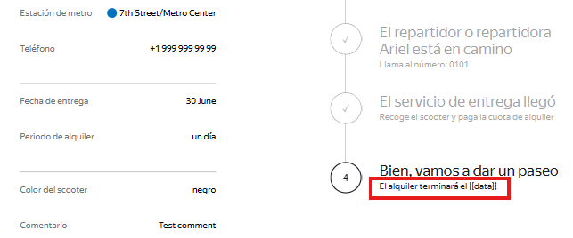
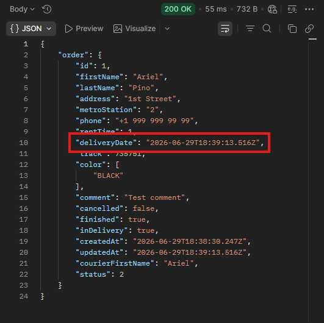

# US-7: Texto del 4to estado muestra "{{data}}" sin reemplazar y la redacción difiere del requisito

# Detalles clave

## Severidad
🔵 Minor

## Prioridad
🟨 Medium

## Entorno
- Opera 132, 1280x720 (Chrome bloqueado por [US-1](./US-1.md))
- Postman 12.16.4
- Api Ez-scooter versión 1.0.0

## Componente
Estado del Pedido - Cadena de Estados

## Descripción
Al activarse el cuarto estado “Bien, vamos a dar un paseo“, el aviso que debería mostrar la fecha de finalización del alquiler aparece con el marcador de plantilla `{{data}}` sin reemplazar. Además, la redacción difiere de los indicado en los requisitos.

> *“El texto ‘El alquiler finalizará el’ aparece debajo del título de estado. El tiempo mostrado se calcula desde el momento en que se entrega el scooter al usuario o usuaria, considerando el número de días.“*

### Precondiciones
- Pedido creado, aceptado por el mensajero, y con el estado 4 activo.
- Si [US-5](./US-5.md) persiste, se ha forzado la completitud de los registros duplicados para llegar al estado 4 (workaround). Aun así, el texto es independiente del duplicado.

### Pasos para reproducir
1. En Opera 1280x720, ir a “Estado del pedido“.
2. Ingresar un número de pedido que se encuentre en el estado 4.
3. Observar el texto debajo del título “Bien, vamos a dar un paseo”.

### Resultado esperado
Muestra: **“El alquiler finalizará el <fecha_calculada>“.**

### Resultado actual
**Muestra: “El alquiler terminará el {{data}}“.**

### Evidencia

#### Captura de pantalla del cuarto estado activo donde se ve el texto del anuncio

#### Respuesta de la API que alimenta ese campo
