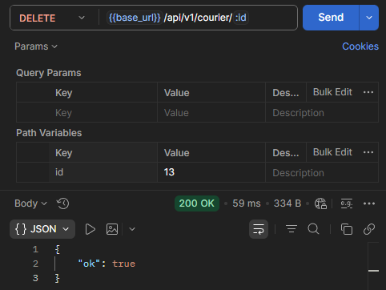
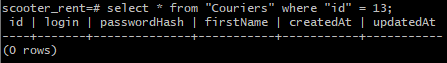
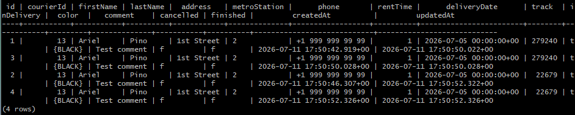

# US-70: DELETE /api/v1/courier/:id elimina al repartidor pero no borra sus pedidos vinculados en la tabla Orders

# Detalles clave

## Severidad
🟠 Major

## Prioridad
🟧 High

## Entorno
- API Ez-scooter v1.0.0
- Postman 12.17.3

## Componente
API - Eliminar un mensajero

## Descripción

Según los requisitos del back-end, al eliminar la cuenta de un repartidor, los pedidos vinculados en la tabla `Orders` deben borrarse.

Sin embargo, al enviar una solicitud `DELETE /api/v1/courier/:id` con un ID de repartidor válido que tiene pedidos aceptados, el repartidor se elimina correctamente de la tabla `Couriers`, pero todos los registros de pedidos asociados (campo `courierId`) permanecen intactos en la tabla `Orders`.

### Precondiciones

Existe un repartidor en la tabla `Couriers` con un `id` conocido.

### Pasos para reproducir

1. En Postman, crear una solicitud `POST` a `/api/v1/orders` con el body:

```json
{
    "firstName": "Ariel",
    "lastName": "Pino",
    "address": "1st Street",
    "metroStation": 2,
    "phone": "+1 999 999 99 99",
    "rentTime": 1,
    "deliveryDate": "2026-07-05",
    "comment": "Test comment",
    "color": [
        "BLACK"
    ]
}
```
2. Enviar la solicitud.

3. Copiar el `track` devuelto en la respuesta.

4. Crear una solicitud `GET` a `/api/v1/orders/track?t=<track_pedido_creado>`.

5. Enviar la solicitud.

6. Copiar el `id` del pedido devuelto en la respuesta.

7. Crear una solicitud `PUT` a `/api/v1/orders/accept/:<id_pedido_creado>?courierId=<id_mensajero>`.

8. Enviar la solicitud.

9. Crear una solicitud `DELETE` a `/api/v1/courier/<id_mensajero>`.

10. Ejecutar `select * from "Couriers" where "id" = <id_mensajero_borrado>;`.

11. Observar que ya no está el registro para ese `id`.

12. Ejecutar `select * from "Orders" where "courierId" = <id_mensajero_borrado>;`

### Resultado esperado

- El repartidor se elimina de Couriers.

- Todos los pedidos en `Orders` cuyo `courierId` coincidía con el `id` eliminado han sido borrados.

### Resultado actual

- El repartidor se elimina de `Couriers` correctamente.

- Los pedidos permanecen en `Orders` con el `courierId` intacto, generando registros huérfanos.

### Evidencia

#### Captura de Postman mostrando la respuesta exitosa del DELETE.



#### Captura de una consulta SQL a `Couriers` donde no aparece el registro.



#### Captura de una consulta SQL a `Orders` donde los registros con el CourierId eliminado aún existen.

