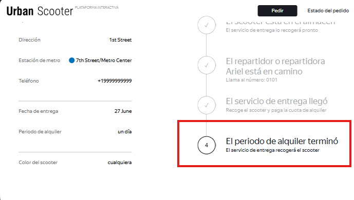
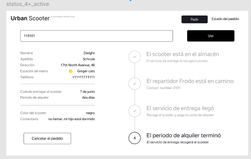

# US-8: El texto del estado "Período de alquiler terminado" no coincide con los requisitos del BRD (aunque sí con Figma)

# Detalles clave

## Severidad
⚪ Trivial

## Prioridad
🟩 Low

## Entorno
- Opera 132, 1280x720 (Chrome bloqueado por [US-1](./US-1.md))
- Postman 12.16.4
- Api Ez-scooter versión 1.0.0

## Componente
Estado del Pedido - Cadena de Estados

## Descripción
Al finalizar el período de alquiler (forzando la fecha desde la base de datos), el 4to estado cambia correctamente su texto, pero el contenido difiere del documento de requisitos.

> - BRD: "Periodo de alquiler terminado" con la leyenda "El repartidor o repartidora recogerá el scooter pronto". 
> - Figma: “El periodo de alquiler terminó“ con la leyenda “El servicio de entrega recogerá el scooter“.

La implementación coincide exactamente con el diseño de Figma, pero contradice el BRD. No está definido cuál es la fuente de verdad para este texto.

### Precondiciones
- Pedido en estado 4 (“Bien, vamos a dar un paseo“).

### Pasos para reproducir
1. En la base de datos, ejecutar `update "Orders" set "deliveryDate" = '2026-0x-xx 00:00:00+00' where "Orders".track = '<numero_pedido_en_estado_4>'`;(Actualizar a una fecha 2 días antes de la fecha que tiene el campo `deliveryDate`).
2. En Opera 1280x720, ir a “Estado del pedido“.
3. Ingresar el número de pedido.
4. Observa el texto del 4to estado.

### Resultado esperado
- Título del estado: “Periodo de alquiler terminado“.
- Leyenda: “El repartidor o repartidora recogerá el scooter pronto“.

### Resultado actual
- Título del estado: “El periodo de alquiler terminó“.
- Leyenda: “El servicio de entrega recogerá el scooter“.

### Evidencia

#### Captura del estado activo tras el vencimiento, mostrando los textos actuales

#### Captura del diseño de Figma que confirma que coinciden
