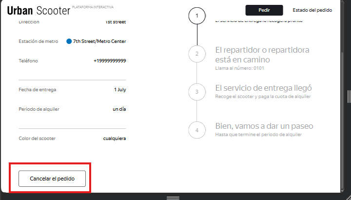
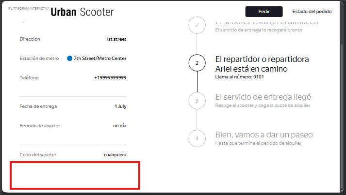

# US-9: El botón "Cancelar el pedido" desaparece en un lugar de permanecer deshabilitado tras la aceptación del repartidor

# Detalles clave

## Severidad
🔵 Minor

## Prioridad
🟩 Low

## Entorno
- Opera 132, 1280x720 (Chrome bloqueado por [US-1](./US-1.md))
- Postman 12.16.4
- Api Ez-scooter versión 1.0.0

## Componente
Estado del Pedido

## Descripción

### Precondiciones
- Se ha creado un pedido nuevo y se ha guardado su número.
- Mediante Postman, se ha solicitado el pedido usando su número de pedido y se ha guardado su ID.
- Se ha creado una cuenta de mensajero.
- Mediante Postman, se ha iniciado sesión usando las credenciales del mensajero creado y se ha guardado su ID que devuelve en la respuesta.

### Pasos para reproducir
1. Abrir la página de Inicio.
2. Hacer clic en “Estado del pedido”.
3. Ingresar el número del pedido y hacer clic en “¡Vamos!”.
4. Observar la presencia del botón en la parte inferior izquierda de la pantalla.
5. Mediante Postman, aceptar el pedido usando el ID del mensajero y el ID del pedido.
6. Hacer clic en el logo de Urban Scooter para volver a la página de inicio.
7. Volver a consultar el pedido con el botón “Estado del pedido“.
8. Observar la parte inferior izquierda de la pantalla.

### Resultado esperado
El botón “Cancelar el pedido“ sigue visible pero aparece en estado deshabilitado (no es cliqueable).

### Resultado actual
El botón “Cancelar el pedido” desaparece completamente de la pantalla.

### Evidencia

#### Captura de pantalla antes de la aceptación

#### Captura de la pantalla después de la aceptación
